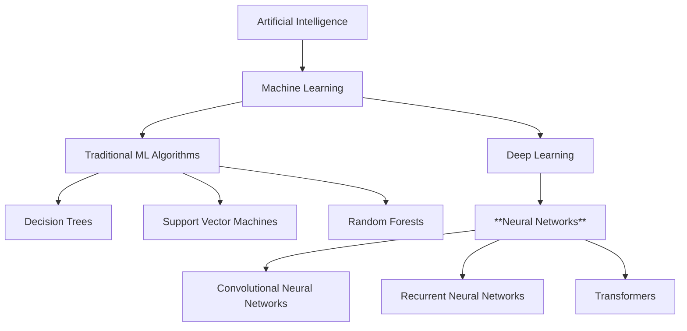

# Project Setup & Linear Model

## Setup

1. Create a new Python project directory
2. Set up a virtual environment
3. Install basic dependencies: numpy and matplotlib

## First Component: A Simple Linear Model

The most basic neural model is just a linear function: `y = wx + b`

### Task:

- Create a file `part1.py`
- Generate some simple data (e.g., points on a line with some noise)
- Implement functions for:
  - Initializing parameters (`w` and `b`)
  - Forward pass (calculating prediction)
  - Calculating loss (mean squared error)
  - Manually update parameters

### Questions to explore:

- What happens if we change the initial weights?
- How would we calculate the error/loss?
- Can we visualize your data and predictions?

## Where do Neural Networks fit in the A.I. umbrella?

