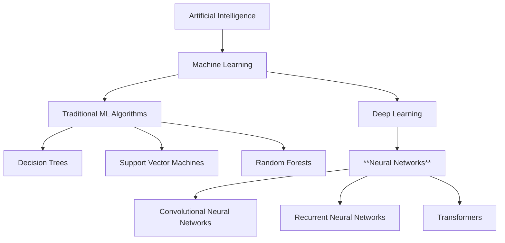

# Part 1. Linear Model & Gradient Descent

For each part, I'll lay out a rough outline of what I should do which is a combination of what I learned from watching Jeremy Howard
build with the Microsoft Excel spreadsheet and [claude.ai](https://claude.ai/new)'s help. I've asked it not to give any "answers" (e.g., the correct code)
but rather to guide me along like a tutor and hinting along the way should I need any assistance.

## Initial Outline

### Setup

1. Create a new Python project directory
2. Set up a virtual environment
3. Install basic dependencies: numpy and matplotlib

### First Component: A Simple Linear Model

The most basic neural model is just a linear function: `y = wx + b`

#### Tasks:

- Create a file `part1.py`
- Generate some simple data (e.g., points on a line with some noise)
- Implement functions for:
  - Initializing parameters (`w` and `b`)
  - Forward pass (calculating prediction)
  - Calculating loss (mean squared error)
  - Manually update parameters

#### Questions to explore:

- What happens if we change the initial weights?
- How would we calculate the error/loss?
- Can we visualize your data and predictions?

## Findings

### Where do Neural Networks fit in the A.I. umbrella?



### Project Setup

I've been using [uv](https://docs.astral.sh/uv/) to set up Python projects so that's what I went ahead and did here. I was first put on to uv when I came
across a [talk](https://www.youtube.com/watch?v=gSKTfG1GXYQ) given by Charlie Marsh, founder of Astral, on the Jane Street Youtube channel.

#### Steps

- created a `pyproject.toml` which contains project metadata
- created a virtual env with `uv` and activated it. This creates an environment that scopes everything I do to the project.
- added dependencies by doing `uv sync`

### Implementation

Here's where I do actual programming and attempt to build a linear model. Claude gave me an outline which is separates the task into parts that I can sort of
"fill in" like a homework sheet. What I'll go ahead and do from here is plan out what it is I'm exactly trying to do and see if I can complete each task from first principles.
I'll do my best to translate what I think we're supposed to do to code which will have a lot of guess & test runs in the CLI. I'll also have to research a bunch of things
that I'm unfamiliar with so there's that.

```python
# Import necessary libraries
import numpy as np
import matplotlib.pyplot as plt

# 1. Generate sample data
# TODO: Create x values and corresponding y values following a linear pattern with noise
# 2. Initialize parameters
# TODO: Create initial values for weight and bias

# 3. Define model functions
# TODO: Implement forward pass function
# TODO: Implement loss calculation function
# TODO: Implement parameter update function

# 4. Training loop
# TODO: Implement iterations of forward pass, loss calculation, and parameter updates

# 5. Visualization
# TODO: Plot original data points and final regression line
# TODO: Plot loss over iterations
```

Looking at the outline, the file looks to be broken down into logical parts of the linear model. I can understand each part on its own but I'm not quite sure I understand what a _linear
model_ is. From watching the lecture and building the spreadsheet, what I think it does is given a set of data points it tries to find the line of best fit which is how it will do predictions.

After some research, I got a ton of information and here's the definition I've summarized for myself: A linear model is essentially drawing a straight line through the data to make predictions.
It assumes a **linear relationship** between inputs and outputs. It seem hand-wavy 👋 here, but since I've prefer to learn from a top-down approach (also recommended by the fast.ai course) the lower
level details will make sense later on. For others reading this that prefer a bottom-up approach, it might be helpful to see the content in [Andrew Ng's course](https://www.coursera.org/specializations/machine-learning-introduction).

Okay so we got the big picture and sort of get the gist of what we're trying to do. Let's generate some sample data and initialize the parameters.

```python
# Import necessary libraries
import numpy as np
import matplotlib.pyplot as plt

# 1. Generate sample data
np.random.seed(42)  # For reproducibility

# Parameters
n_samples = 100
true_slope = 2.5
true_intercept = 5
noise_level = 3

# Generate x values
X = np.random.uniform(0, 10, n_samples)

# Generate y values with some noise to mimic "real world" phenomenon
y = true_slope * X + true_intercept + np.random.normal(0, noise_level, n_samples)

# Split into training and testing sets (80% train, 20% test)
split_idx = int(0.8 * n_samples)
X_train, X_test = X[:split_idx], X[split_idx:]
y_train, y_test = y[:split_idx], y[split_idx:]

# 2. Initialize parameters. In training, these random values will be adjusted through gradient descent
weight = np.random.randn()  # coefficient/slope
bias = np.random.randn()  # intercept

# 3. Define model functions
# TODO: Implement forward pass function
# TODO: Implement loss calculation function
# TODO: Implement parameter update function

# 4. Training loop
# TODO: Implement iterations of forward pass, loss calculation, and parameter updates

# 5. Visualization
# TODO: Plot original data points and final regression line
# TODO: Plot loss over iterations
```

So a lot just happened. The bit of code to generate sample data does this:

1. Sets a fixed random seed for reproducibility
2. Generates 100 random x-values betwen 0-10
3. Creates y-values follwing `y= 2.5x + 5 + noise`
4. The noise uses a normal distribution (aka Gaussian distribution) with standard deviation 3
5. The last part splits our data into training (80%) and testing (20%) sets

Most stuff we may recognize from high school math. I wasn't so great at math but the only unfamiliar thing to me was "Gaussian Distribution" which I got the gist of through Googling and some
short Youtube videos.

Next I have to implement "#3. Define model functions". I have some questions:

- what are model functions?
- what is forward pass, loss calculation, and parameter update?
  - why are these necessary?

So model functions are the core math ops that define how a neural network (or any ML model) works. These functions are revolve around predictions.
We can relate the 3 functions to what Jeremy did in the Excel spreadsheet exercise.

- **Forward Pass** - calculates the model's prediction by applying the current parameters (weight & bias) to the input data.
  - in the spreadsheet, this would be the cells where we multiply our inputs by weights and add bias
- **Loss Calculation** - measures the error between our predictions and actual values
  - in the spreadsheet, this would be the cells that calculate how far off our predictions are from the actual values
- **Parameter Update** - adjusts the model parameters (weight & bias) to reduce the loss in the spreadsheet, this would be the cells where we multiply our inputs by weights and add bias

Given the definitions and what was done in the spreadsheet exercise, we can translate it to Python like so:

```python
# 3. Define model functions
def forward_pass(x: float, weight: float, bias: float) -> float:
    return x * weight + bias


def loss_calculation(y_pred: float, y_true: float) -> float:
    return np.mean((y_pred - y_true) ** 2)


def parameter_update(
    w: float, b: float, x: float, y: float, y_pred: float, learning_rate: float
) -> Tuple[int, int]:
    num_inputs = len(x)
    derivative_weight = -2 / num_inputs * np.sum(x * (y - y_pred))
    derivative_bias = -2 / num_inputs * np.sum(y - y_pred)

    weight = w - learning_rate * derivative_weight
    bias = b - learning_rate * derivative_bias

    return (weight, bias)
```

The first two functions, `forward_pass` and `loss_calculation`, were straightforward. I didn't quite remember what derivatives were so I had to look up
what they were before translating it to Python. The derivative tells us how much `y` changes when `x` changes. Derivatives are used to minimize
the error between predictions and actual values. They guide the learning process by showing which direction to adjust parameters to reduce error.

#### Quick note: Gradient Descent

_Gradient descent_ tries to find the minimum of the loss function by adjusting model parameters. Imagine you're in a mountain valley surrounded by fog. Your
goal is to reach the lowest point in the valley, but you can't see anything.

Your likely steps would be:

1. **Feel the slope.** The gradient tells you the direction of the descent and the steepness of that descent.
2. **Take a step.** The size of your step is important. If it's too small, you'll take forever to reach the bottom. If it's too big, you might overshoot.
3. **Repeat.** Iterating let's us repeatedly adjust our direction and steepness while taking count of how close we are to the bottom. We do this until we hit the valley.

So taking it back to the model, mathematically, we are:

- calculating the gradient (feel the slope)
- move in the appropriate direction proportional to both the gradient and the learning rate (take a step)
- iterate (repeat)

Implementing iterations of forward pass, loss calculation and parameter updates is paralleled by these things in the spreadsheet exercise:

- Excel cells that calculate predictions became our `forward_pass` function
- The cells that calculate error became our `loss_calculation` function
- The cells that update weights became our `parameter_update` function

#### Visualization

This section was the fun part because I got to see the results of what I've built so far and helped things "click". It was similar to writing a bunch of frontend
code and seeing the visual changes in the UI. This was pure matplotlib and their docs tell you a lot. They give lots of examples on their sites and you can search
online for many cases not covered in their documentation.

Plotting the training data vs test data on the scatter plot was cool to see the distribution of which values were selected for training vs testing. Seeing the
line of best fit compared to the true line gives us an indicator of how close our model's predictions were. The loss history taught us that in the beginning, the
values are random and way-off but they take a sharp turn towards the right direction (gradient descent!!). Whether this is true for all models or even all linear
regression models, I'll have to research that. For now, that's part 1 👍🏻.
