# Neural Network from Scratch - Part 2: Non-Linearity & Multi-Layer Networks

For Part 2, I'll be adding non-linearity through activation functions and expanding to multiple layers—the key components that make a neural network powerful. Whatever that means 🤷🏻‍♂️.

## Prep

### Learning Objectives for Part 2

- Understand why non-linearity is essential in neural networks
- Implement the ReLU activation function and its derivative
- Build a multi-layer architecture with hidden layers
- Extend backpropagation to work across multiple layers
- Train our network on non-linearly separable data

### Research Areas

To help with my own research, I'll explore these topics:

- **Why non-linearity matters**: What happens if you stack linear layers without activation functions?
- **ReLU vs. other activation functions**: How does ReLU compare to sigmoid or tanh?
- **Vanishing/exploding gradients**: Why can these be problems in deep networks?
- **Backpropagation algorithm**: Understand the chain rule as it applies to neural networks
- **Hidden layer neurons**: How does the number of neurons affect network capacity?

### Excel Mapping (Connecting to Jeremy Howard's Approach)

To relate back to the Excel-based model:

- ReLU would be an IF statement in Excel: `=IF(A1>0,A1,0)`
- Multiple layers would be multiple sheets or sections, each with its own weights
- Backpropagation would calculate how each cell's value affects the final error

## Findings

### Why non-linearity matters

It matters because it allows neural networks to model complex, real-world data and intricate relationships. In a scenario without non-linearity,
if you stack linear layers it doesn't matter how many layers you have, you would just get a linear function which is essentially a single linear layer.

### ReLU vs. other activation functions

To simplify comparisons, the other activation functions that ReLU is often compared to are Tanh and sigmoid. Let's define the characteristics of these 3 activation functions:

- **ReLU (Rectified Linear Unit)**: Most commonly used and defined as `f(x) = max(0, x)` (negative numbers become 0)
- **sigmoid**: Squashes values between 0 and 1, historically important but prone to vanishing gradients
- **Tanh**: Similar to sigmoid but outputs values between -1 and 1, zero-centered

Just some quick research online and I've learned that the strong points for **ReLU** are that it is computationally efficient, has no vanishing gradient problem and
because it sets negative values to 0, this leads to sparsity which helps with model generalization (but could maybe hinder some other things?). There are some other cool problems
that each activation function is great at and not so great at so a quick prompt into your preferred LLM will tell you a lot about that.

### Vanishing/exploding gradients

A **gradient** tells us how much and in what direction to adjust each weight to reduce the error. These gradient problems both occur during _backpropagation_ and makes learning at the early layers slow and introduces the possibility of the model failing to converge.

**Vanishing gradient**: During backpropagation, the gradients become very small as a result of repeated multiplication of small numbers (<1). This occurs with the sigmoid and tanh activation functions because these functions have a range of 0-1 and -1 to 1, this makes the derivatives approach 0.
As a result, the gradient descent algorithm never converges to the optimal solution.
**Exploding gradient**: During backpropagation, the gradients become very large and we end up with big weight updates hich leads to the divergence of the gradient descent algo. This is a resultA of the _initial weights_ assigned to the neural networks creating large losses. This leads to unstable training, erratic weight updates, and numerical overflow.

### Backpropagation algo

Backpropagation (or backward pass) is essentially a method to enable the neural network to learn from its mistakes. Conceptually, backpropagation is applying the chain rule of Calculus which tells us how to differentiate composite functions.

To understand this methodically, let's spell out the steps. The steps for backpropagation would be:

1. **forward pass** - computes output
2. **calculate loss** - how good or bad our model's predictions are compared to the actual results
3. **backpropagation (backward pass)** - error is "propagated" backward through the layers of the network
4. **gradient calculation** - at each layer, the gradient of the error, with respect to the weights and biases, is computed
5. **weight updates** - weights and biases are adjusted based on calculated gradients using an algo like gradient descent
6. **iteration** - next forward pass happens with w/ updated weights and repeats the process under the desired performance is reached

### Hidden layer neurons

A hidden layer is a layer between the input and output layers of the neural network. These hidden layers connect the input and output layers, finding underlying patterns within the data. Each hidden layer contains neurons (aka nodes) that interacts with the data in one simple way. There can be multiple nodes in each layer that talk to nodes in the next layer.
Data from the input layer would flow to the next hidden layer neurons and from there to the next hidden layer's neurons and so on until they reach the output. This flow of data through the hidden layers has a compounding effect that affects how well the model makes predictions. An algorithm is considered "deep learning" when it contains more than 3 layers
(input, hidden, output).

There is an ideal number of hidden layer neurons that can be reached and adding more neurons after this piont provides little to no significant increase in accuracy. In fact, Jeremy mentions this concept in the course called _overfitting_ where
the model learns the training data too well which resuts in poor performance on new, unseen data.

#### Examples

**Hidden layers of recurrent neural networks (RNNs)**

- RNNs work specifically with time series or sequential data. Some example applications of RNNs are:
  - translating text from one language to another
  - text generation
  - stock market prediction
  - weather forecasting
  - image captioning
  - anomaly detection
- hidden layers in RNNs have the ability to remember results of previous calculations. The "store memories" are managed in a hidden state within the hidden layers.

**Hidden layers of convolutional neural networks (CNNs)**

- CNNs are great for classification or computer vision tasks. Some example applications of CNNs are:
  - image classification
  - object detection
  - text classification
  - medical image analysis
  - facial recognition
- CNNs have 3 main types of hidden layers:
  - convolutional layers - use feature extraction to perform the main "work" of the CNN
  - pooling layers - simplifies the work of the convolutional layers, losing data in the process but gaining a more efficient and less complex output
  - fully-connected layers - every node in this layer connects to every node in the previous layer to mape info gained form the previous two layers (input and hidden), classifying for output

**Hidden layers of generative adversarial neural networks (GANs)**

• Competitive Structure - GANs consist of two neural networks (generator and discriminator) that compete against each other - the generator tries to create fake data so realistic that the discriminator cannot distinguish it from real training data, while the discriminator tries to identify the fakes.
• Learning Through Competition - The adversarial game drives continuous improvement in both networks, as each tries to outperform the other, leading to progressively better fake data generation and detection capabilities over time.
• Training Process - Both networks use backpropagation and access the same training dataset, with the generator "winning" when it creates output so convincing that the discriminator fails to detect it as fake, resulting in novel, realistic generated content.
• Flexible Architecture- The specific implementation of hidden layers varies depending on the GAN variant (such as DCGANs using convolutional layers), but the core competitive principle remains consistent across different model types.

### (Bonus finding) The XOR problem

XOR (exclusive OR) is a binary operation that returns 1 if the two inputs are different; if they are the same, the output is 0. The problem is that a single-layer perceptron cannot solve this problem because the data is not linearly separable.
In other words, we can't draw a single straight line to separate the data points to classify all inputs. There's some underlying math to prove this (some good research will demonstrate this) but we can understand that until we add non-linearity
we are limited in the problems we can solve.

Oh btw, _perceptron_ is simply an artificial neuron that is capable of learning. Frank Rosenblatt built the first perceptron called "Mark I Perceptron".

### Diagram of `part2.py`

Leaving a diagram here to illustrate the flow of data and calculations. I'll have to update this with more thoughts during this exercise after I finish the visualization in jupyter notebooks.

```mermaid
graph TD
    A[Input Data: X] --> B[Hidden Layer<br/>X * w1 + b1 → ReLU]
    B --> C[Output Layer<br/>a1 * w2 + b2]
    C --> D[Loss Calculation<br/>MSE]
    
    D --> E[Backpropagation<br/>Calculate Gradients]
    E --> F[Update Parameters<br/>w1, b1, w2, b2]
    
    F --> G[Next Iteration]
    G --> A
    
    style A fill:#e1f5fe
    style B fill:#fff3e0
    style C fill:#f3e5f5
    style D fill:#ffebee
    style E fill:#e8f5e8
    style F fill:#fff8e1
```

